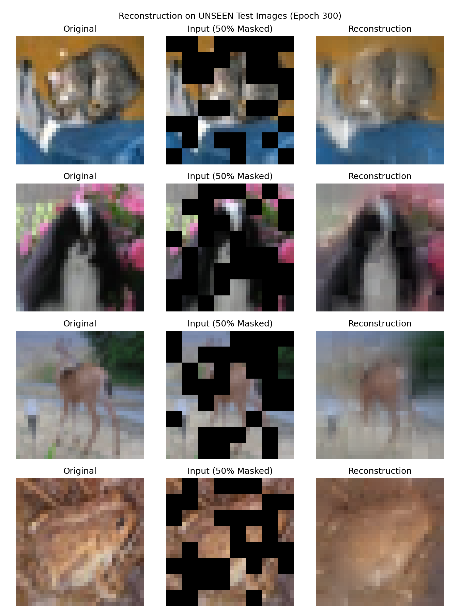
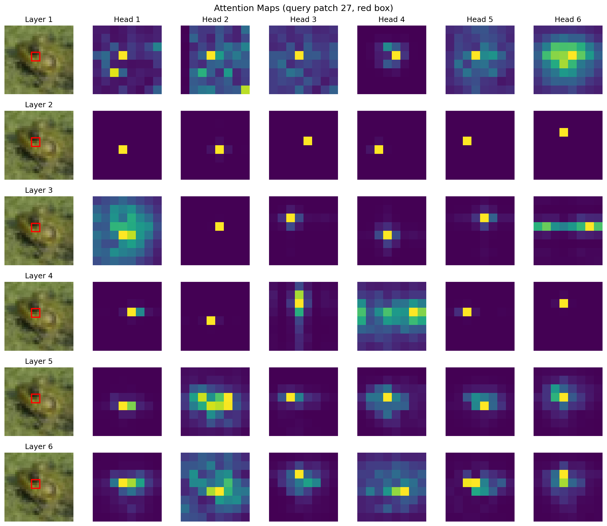
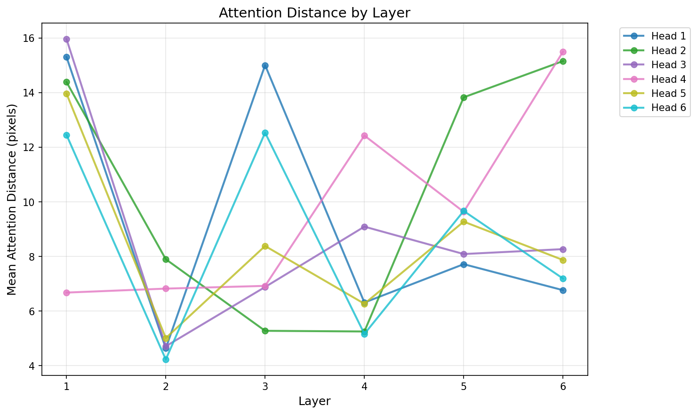

# self-taught-vit


I watched DINOv3, a massive unsupervised ViT, segment objects it had never seen during training, match the same object accross two very different enviroments, and generally grasp visual concepts. I could hardly believe it, so I set out to test a simple question myself: if you force a tiny ViT to reconstruct lots of images, can it also learn semantic features?

Turns out, yes: I trained a ~2.7M-parameter ViT on CIFAR-10 without labels, then evaluated its learned representations with a linear probe that reached 47% accuracy, where 10% is the random baseline (since there are 10 classes).


### Method and Attentions
The model learns semantic structure purely through reconstruction. During training, half of the image patches are masked randomly, and the network learns by predicting the missing pixels to minimize loss.

The attention heads even seems to specialize (some track edges, some track textures) without being told to.





## Run it

```bash
# train
uv run python scripts/train.py

# probe (train linear classifier on frozen features)
uv run python scripts/linear_probe.py

# viz
uv run python scripts/attention_viz.py
```

Checkpoint included (`checkpoints/vit_epoch_300.pth`) if you want to skip training.


